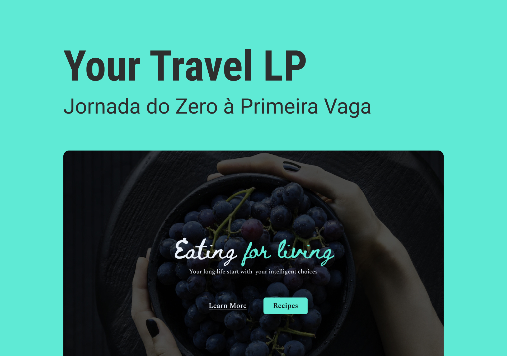

<h1 align="center"> Landing page Eating For Living </h1>

Programa exclusivo promovido pela Rocketseat para ensino de tecnologias WEB.  

  <a href="https://saraguanais.github.io/Desafio-Travel/" target="_blank" >Acesse o Projeto</a>&nbsp;&nbsp;&nbsp;&nbsp;&nbsp;&nbsp;

 

  

## 🚀 Tecnologias

Esse projeto foi desenvolvido com as seguintes tecnologias:

- HTML e CSS
- Git e Github
- Figma

---

Feito com ♥ by Sara Guanais
